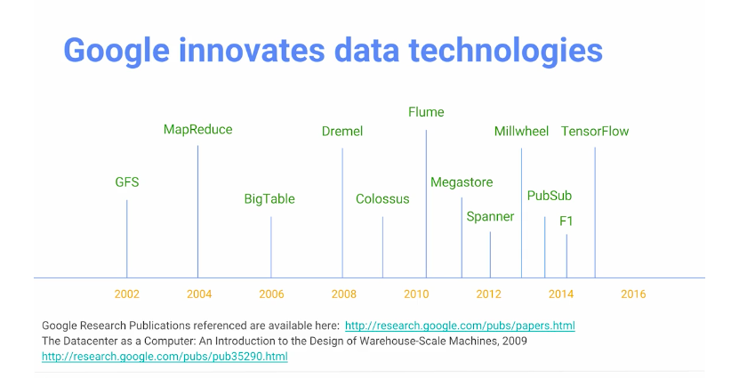
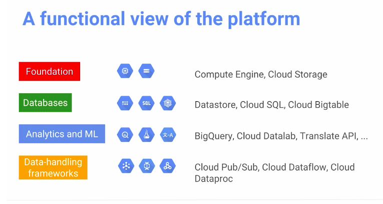

# Google Cloud Platform Big Data and Machine Learning Fundamentals

## Module 1: Introduction to Google Cloud Platform and its Big Data Products 
Instructor: Valliappa Lakshmanan (Lak)
 [https://medium.com/@lakshmanok](https://medium.com/@lakshmanok)
 * Works at Google
 * Previously at NOAA

Definition and Benefits of Cloud: 
* duh

 Google typically runs into big data problems before other companies  
 

 Platform:  
 

## Module 2: Foundations of GCP Compute and Storage

They have a real (cool) cloud! 

## Module 3: Data Analysis on the Cloud
Most of the value in this module is from the labs.   
Labs: 
* [cloud storage](https://codelabs.developers.google.com/codelabs/cpb100-cloud-storage/)
* [sql](https://codelabs.developers.google.com/codelabs/cpb100-cloud-sql/)
* [dataproc](https://codelabs.developers.google.com/codelabs/cpb100-dataproc/#0)

## Module 4: Scaling Data Analysis: Compute with GCP

The [Tensorflow Playground](https://playground.tensorflow.org) is super cool

Labs: 
* [BigQuery](https://codelabs.developers.google.com/codelabs/cpb100-bigquery-dataset/)
* [ML with TensorFlow](https://codelabs.developers.google.com/codelabs/cpb100-tensorflow/)
* [Machine Learning APIs](https://codelabs.developers.google.com/codelabs/cpb100-translate-api/)

## Module 5: Data Processing Architectures: Scalable Ingest, Transform and Load

Google Pub/Sub and Dataflow

## Module 6: Summary of Google Cloud Platform, Big Data, and ML 

* Why Cloud
* Why Google Cloud
* Start on GCP 
* Google Data-Related Products