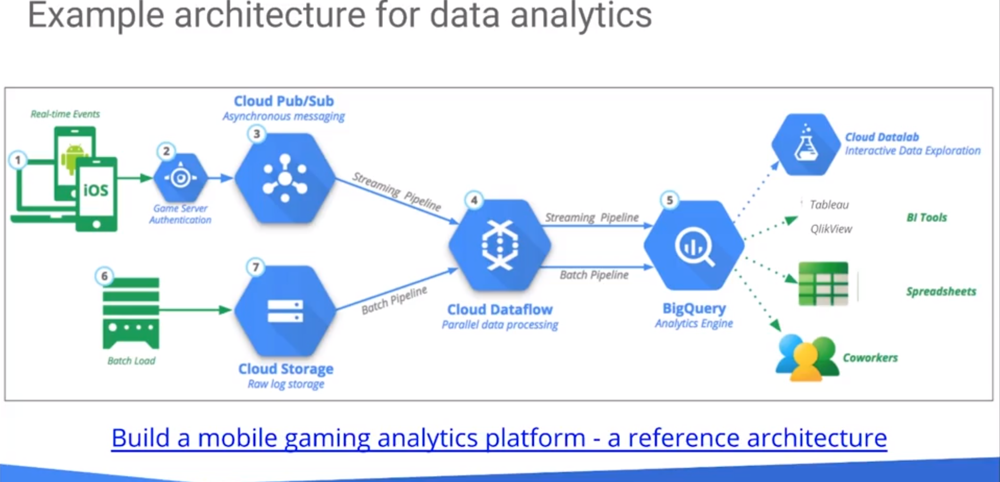
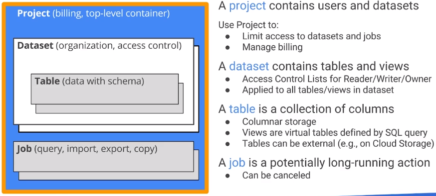

# Serverless Data Analysis with Google BigQuery and Cloud Dataflow 

## Welcome to Serverless Data Analysis with Google BigQuery and Cloud Dataflow

Basically, this course is as the title says it is. 

## Module 1: Serverless Data Analysis with BigQuery

* BigQuery is cool - Petabyte scale DB at almost Real-Time
* Pay for the amount of data your process (basically by query) 
* SQL 2011
* Storage is seperate - Google Cloud Storage
* Can process JSON 
* Fully managed, "cluster free" 
* Imutable audit logs 
* Can share queries 
* Columnar 

Example Architecture:  

How Access controll, etc works 

#### Lab 1a: Building a BigQuery Query
In this lab, you learn how to build up a complex BigQuery using clauses, subqueries, built-in functions and joins.  

What you need  

To complete this lab, you need:  

Access to a supported Internet browser:  

The latest version of Google Chrome, Firefox, or Microsoft Edge
Microsoft Internet Explorer 11+
Safari 8+ (Safari private mode is not supported)
A Google Cloud Platform project  

What you learn  

In this lab, you:  

* Create and run a query
* Modify the query to add clauses, subqueries, built-in functions and joins.   
Begin the lab
https://codelabs.developers.google.com/codelabs/cpb101-bigquery-query/

#### Lab: Advanced Capabilities

## Module 2: Autoscaling Data Processing Pipelines with Dataflow

#### Lab: Data Pipeline

#### Lab: MapReduce in Dataflow

#### Lab: Side Inputs

#### Lab: Streaming

