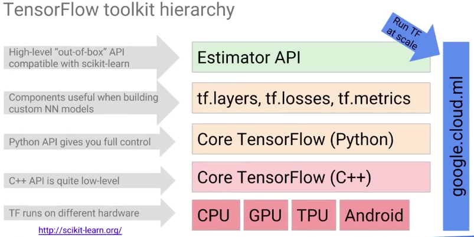

# Serverless Machine Learning with Tensorflow on Google Cloud Platform

## Welcome to Serverless Machine Learning on Google Cloud Platform

* Data Engineers - reduced 
* Machine Learning ~ tune parameters on function to predict values 
* Machine Learning algorithms need numbers
* Try Tensorflow [http://playground.tensorflow.org](http://playground.tensorflow.org)

## Module 1: Getting Started with Machine Learning

Vector, Matrix, Tensor!?  
| Rank | Name     | Explanation               |
| -----| :------: | ---------------           |
| 0	   | Scalar   | (magnitude only)          |
| 1  	 | Vector   | (magnitude and direction) |
| 2    | Matrix   | (table of numbers)        |
| 3    | 3-Tensor | (cube of numbers)         |
| n	   | n-Tensor | (you get the idea)        |

Terms Defined: 
* Input - 
* 
* Weights - 
* Batch Size - size of evaluation
* Gradient Decsent - method of evaluation (lowest error)
* Evaluation - evaluating over entire dataset 
* Training - 
* Epoch - traversal through dataset 

#### Create Machine Learning Datasets
In this lab, you will:

Explore a dataset using BigQuery and Datalab
Sample the dataset and create training, validation, and testing datasets for local development of TensorFlow models
Create a benchmark to evaluate the performance of ML against
What you need
To complete this lab, you need:

A Google Cloud Platform project (if not, please sign up for a free trial and come back here).
Begin the lab
https://codelabs.developers.google.com/codelabs/dataeng-machine-learning/

## Module 2: Building ML models with Tensorflow

[**Tensorflow**](https://www.tensorflow.org/) 
* Data flow graphs - separate construction and execution 
* Portable (C++)

#### Getting Started with Tensorflow 
In this lab, you will learn the following on how the TensorFlow Python API works:

* Building a graph
* Running a graph
* Feeding values into a graph
* Find area of a triangle using TensorFlow   

Begin the Lab 
https://codelabs.developers.google.com/codelabs/dataeng-machine-learning/index.html?index=#5

Note: You should only complete Parts 1-5 of this Codelab and then return to this course.

#### Machine Learning using tf.learn 
In this lab, you will implement a simple machine learning model using tf.learn:

* Read .csv data into a Pandas dataframe
* Implement a Linear Regression model in TensorFlow
* Train the model
* Evaluate the model
* Predict with the model
* Repeat with a Deep Neural Network model in TensorFlow  

Begin the Lab
https://codelabs.developers.google.com/codelabs/dataeng-machine-learning/index.html?index=#6

Note: Only complete Part 7 of the Codelab and then return to this course.

#### TensorFlow on Big Data 
In this lab, you will learn how to:

* Read from a potentially large file in batches
* Do a wildcard match on filenames
* Break the one-to-one relationship between inputs and features  
 
Begin the Lab 
https://codelabs.developers.google.com/codelabs/dataeng-machine-learning/index.html?index=#7

Note: Only complete Part 8 of the Codelab and then return to this course.

## Module 3: Scaling ML models with Cloud ML Engine

## Module 4: Feature Engineering

